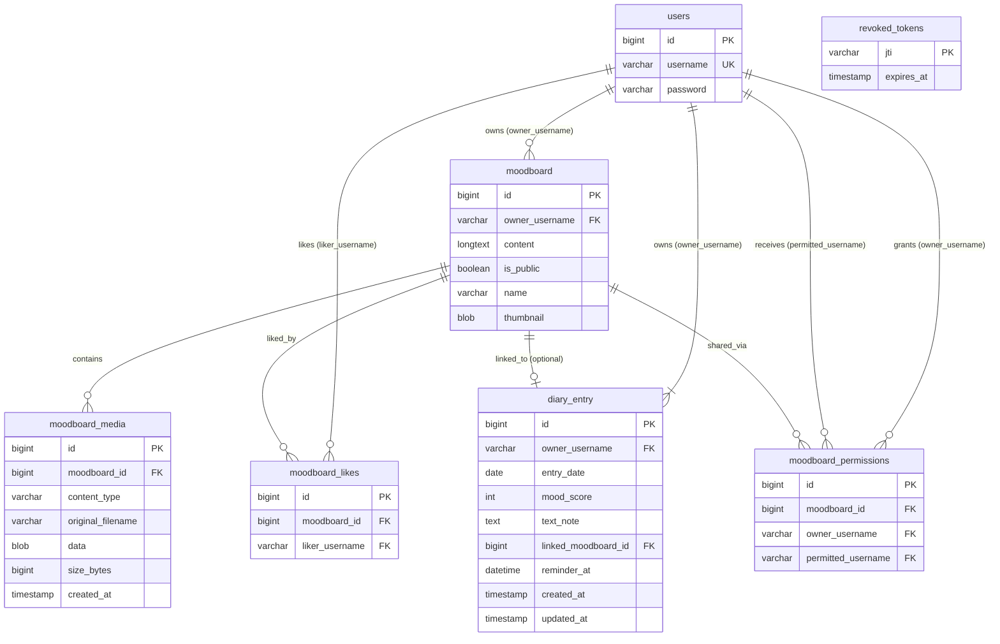

# Emotion Diary Server — Architecture Diagrams

Database model and layered application structure for the Spring Boot backend.

Open this file in Markdown preview (VS Code / Cursor / GitHub) to render the Mermaid diagrams.

---

## Entity Relationship Diagram

Seven JPA entities. All user FKs reference `users.username` (not `users.id`). Associations are unidirectional `@ManyToOne(LAZY)`.

### Constraints and delete behavior

| Rule | Detail |
|------|--------|
| Diary uniqueness | One entry per user per day (`owner_username` + `entry_date`) |
| Like uniqueness | One like per user per moodboard (`moodboard_id` + `liker_username`) |
| Permission uniqueness | One grant per user per moodboard (`moodboard_id` + `permitted_username`) |
| Delete user | RESTRICT while referenced by moodboards, diary entries, likes, or permissions |
| Delete moodboard | CASCADE to media, likes, permissions; SET NULL on `diary_entry.linked_moodboard_id` |
| RevokedToken | Standalone table — no FK to `users` |

---

## Class Diagram

Layered Spring Boot architecture (~27 key classes). Controllers delegate to services; services use repositories to access entities.

### Architecture notes

- **Layering**: Controllers handle HTTP mapping only; business logic lives in services; persistence goes through Spring Data repositories.
- **EntityReferences**: Shared helper for consistent `requireUser()` / `requireMoodboard()` lookups with validation errors.
- **Security services**: `MoodboardAccessService` (authorization), `MoodboardPermissionService` (grants), and `MoodboardLikeService` (likes) sit alongside domain services.
- **JPA mapping**: Unidirectional `@ManyToOne(LAZY)` — no `@OneToMany` on parent entities.

### Request flow (example)

