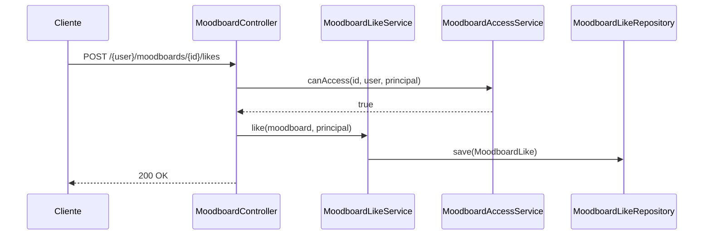

# Emotion Diary Server — Diagramas de arquitectura

Modelo de base de datos y estructura en capas de la aplicación Spring Boot.

Abre este archivo en la vista previa de Markdown (VS Code / Cursor / GitHub) para renderizar los diagramas Mermaid.

---

## Diagrama entidad-relación

Siete entidades JPA. Todas las FK hacia usuarios referencian `users.username` (no `users.id`). Las asociaciones son unidireccionales `@ManyToOne(LAZY)`.

### Restricciones y comportamiento al eliminar

| Regla | Detalle |
|-------|---------|
| Unicidad del diario | Una entrada por usuario y día (`owner_username` + `entry_date`) |
| Unicidad de likes | Un like por usuario y moodboard (`moodboard_id` + `liker_username`) |
| Unicidad de permisos | Una concesión por usuario y moodboard (`moodboard_id` + `permitted_username`) |
| Eliminar usuario | RESTRICT mientras existan referencias desde moodboards, entradas del diario, likes o permisos |
| Eliminar moodboard | CASCADE en media, likes y permisos; SET NULL en `diary_entry.linked_moodboard_id` |
| RevokedToken | Tabla independiente — sin FK hacia `users` |

---

## Diagrama de clases

Arquitectura Spring Boot en capas (~27 clases principales). Los controladores delegan en servicios; los servicios usan repositorios para acceder a las entidades.

```mermaid
classDiagram
    direction TB

    class AuthController {
        +register()
        +login()
        +logout()
    }
    class DiaryController {
        +listEntries()
        +getEntry()
        +upsertEntry()
        +deleteEntry()
    }
    class MoodboardController {
        +getMoodboards()
        +createMoodboard()
        +grantAccess()
        +likeMoodboard()
    }
    class PublicMoodboardController {
        +getPublicMoodboards()
    }
    class UserController {
        +searchUsers()
    }
    class ProfileController {
        +changePassword()
    }
    class MetricsController {
        +getMetrics()
    }
    class GlobalExceptionHandler {
        +handleValidation()
        +handleAuth()
    }

    class AuthService {
        +register()
        +logout()
        +changePassword()
    }
    class UserService {
        +loadUserByUsername()
        +searchUsersByPrefix()
        +existsByUsernameIgnoreCase()
    }
    class DiaryEntryService {
        +findInRange()
        +findByDate()
        +upsert()
        +deleteByDate()
    }
    class MoodboardService {
        +save()
        +findById()
        +update()
        +deleteById()
    }
    class MoodboardContentService {
        +serialize()
        +deserialize()
        +validate()
    }
    class MoodboardMediaService {
        +upload()
        +findByIdAndMoodboardId()
        +deleteByIdAndMoodboardId()
    }
    class MoodboardLikeService {
        +like()
        +unlike()
        +countByMoodboardId()
        +getLikedMoodboards()
    }
    class MoodboardPermissionService {
        +grantAccess()
        +revokeAccess()
        +listPermittedUsernames()
    }
    class MoodboardAccessService {
        +canAccess()
    }
    class MetricsService {
        +computeMetrics()
    }
    class EntityReferences {
        +requireUser()
        +requireMoodboard()
    }

    class UserRepository {
        <<interface>>
    }
    class DiaryEntryRepository {
        <<interface>>
    }
    class MoodboardRepository {
        <<interface>>
    }
    class MoodboardMediaRepository {
        <<interface>>
    }
    class MoodboardLikeRepository {
        <<interface>>
    }
    class MoodboardPermissionRepository {
        <<interface>>
    }
    class RevokedTokenRepository {
        <<interface>>
    }

    class User {
        +id
        +username
        +password
    }
    class Moodboard {
        +id
        +content
        +isPublic
        +name
    }
    class DiaryEntry {
        +id
        +entryDate
        +moodScore
        +textNote
    }
    class MoodboardMedia {
        +id
        +contentType
        +data
    }
    class MoodboardLike {
        +id
    }
    class MoodboardPermission {
        +id
    }
    class RevokedToken {
        +jti
        +expiresAt
    }

    namespace controlador {
        class AuthController
        class DiaryController
        class MoodboardController
        class PublicMoodboardController
        class UserController
        class ProfileController
        class MetricsController
        class GlobalExceptionHandler
    }

    namespace servicio {
        class AuthService
        class UserService
        class DiaryEntryService
        class MoodboardService
        class MoodboardContentService
        class MoodboardMediaService
        class MoodboardLikeService
        class MoodboardPermissionService
        class MoodboardAccessService
        class MetricsService
        class EntityReferences
    }

    namespace repositorio {
        class UserRepository
        class DiaryEntryRepository
        class MoodboardRepository
        class MoodboardMediaRepository
        class MoodboardLikeRepository
        class MoodboardPermissionRepository
        class RevokedTokenRepository
    }

    namespace modelo {
        class User
        class Moodboard
        class DiaryEntry
        class MoodboardMedia
        class MoodboardLike
        class MoodboardPermission
        class RevokedToken
    }

    AuthController --> AuthService
    DiaryController --> DiaryEntryService
    MoodboardController --> MoodboardService
    MoodboardController --> MoodboardContentService
    MoodboardController --> MoodboardMediaService
    MoodboardController --> MoodboardLikeService
    MoodboardController --> MoodboardPermissionService
    MoodboardController --> MoodboardAccessService
    PublicMoodboardController --> MoodboardService
    PublicMoodboardController --> MoodboardLikeService
    UserController --> UserService
    ProfileController --> AuthService
    MetricsController --> MetricsService

    AuthService --> UserRepository
    AuthService --> UserService
    UserService --> UserRepository
    DiaryEntryService --> DiaryEntryRepository
    DiaryEntryService --> EntityReferences
    MoodboardService --> MoodboardRepository
    MoodboardContentService --> MoodboardMediaRepository
    MoodboardMediaService --> MoodboardMediaRepository
    MoodboardLikeService --> MoodboardLikeRepository
    MoodboardLikeService --> EntityReferences
    MoodboardPermissionService --> MoodboardPermissionRepository
    MoodboardPermissionService --> UserService
    MoodboardPermissionService --> EntityReferences
    MoodboardAccessService --> MoodboardPermissionRepository
    MoodboardAccessService --> MoodboardRepository
    MetricsService --> DiaryEntryRepository
    EntityReferences --> UserRepository
    EntityReferences --> MoodboardRepository

    UserRepository ..> User
    DiaryEntryRepository ..> DiaryEntry
    MoodboardRepository ..> Moodboard
    MoodboardMediaRepository ..> MoodboardMedia
    MoodboardLikeRepository ..> MoodboardLike
    MoodboardPermissionRepository ..> MoodboardPermission
    RevokedTokenRepository ..> RevokedToken

    DiaryEntry --> User : propietario
    DiaryEntry --> Moodboard : moodboardVinculado
    Moodboard --> User : propietario
    MoodboardMedia --> Moodboard
    MoodboardLike --> Moodboard
    MoodboardLike --> User : usuarioQueDaLike
    MoodboardPermission --> Moodboard
    MoodboardPermission --> User : propietario
    MoodboardPermission --> User : autorizado
```

### Notas de arquitectura

- **Capas**: Los controladores solo mapean HTTP; la lógica de negocio está en los servicios; la persistencia pasa por repositorios Spring Data.
- **EntityReferences**: Helper compartido para búsquedas consistentes con `requireUser()` / `requireMoodboard()` y errores de validación.
- **Servicios de seguridad**: `MoodboardAccessService` (autorización), `MoodboardPermissionService` (concesiones) y `MoodboardLikeService` (likes) conviven con los servicios de dominio.
- **Mapeo JPA**: `@ManyToOne(LAZY)` unidireccional — sin `@OneToMany` en las entidades padre.

### Flujo de petición (ejemplo)

